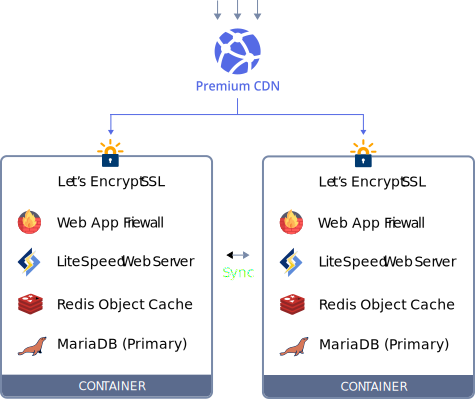
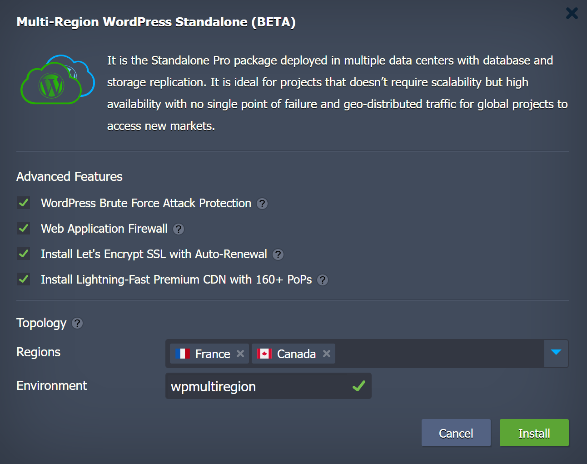
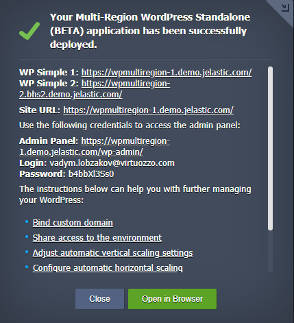
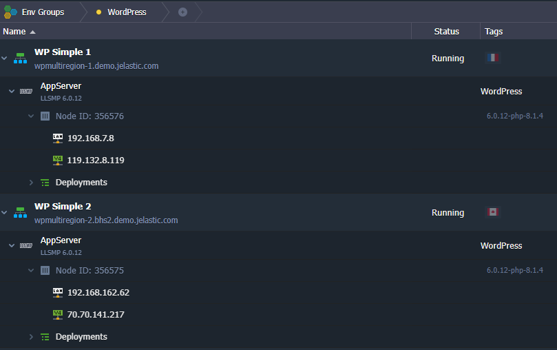

 

# Highly Available Multi-Region Simple WordPress Cluster 

Out-of-the-Box most cost-effective WordPress Cluster deployed across two regions with High Availability that can withstand to even cloud datacentre failure

## Cluster Components

Cluster is based on Virtuozzo certified Elastic Standalone LLSMP or LEMP containers:
- LLSMP container is created from (Linux + LiteSpeed + MariaDB + PHP) template with a set of built-in advanced features.
- LEMP container is created from (Linux + NGINX + MariaDB + PHP) template with a set of built-in advanced features.

 

#### Premium CDN
CDN Add-On is an optional feature that may be integrated into the WordPress application. It utilizes a highly interconnected global network with massive bandwidth capacity, advanced static assets caching, and high-speed modern HTTP/3 support, which ensures lightning-fast content loading for WordPress sites. Virtuozzo customers get premium traffic for the same price across all continents and countries with no surprising bills based on geographic locations.

#### Let’s Encrypt SSL
Let’s Encrypt SSL Add-On does the routine but yet important system administration tasks for issuing trusted SSL certificates, integrating them into the application server, and enabling fully automated certificate renewal to stay secure over time.

#### LiteSpeed Web Server
[LiteSpeed Web Server](https://www.virtuozzo.com/application-platform-docs/litespeed-web-server/) (LSWS) is a high-performance and low memory consuming web server. It includes ESI caching, browser, and object cache along with the support of HTTP/3, CDN, WAF, Geo-DNS, reCAPTCHA protection, cutting-edge anti-DDoS protection.

In Virtuozzo PaaS, LiteSpeed Web Server is provided to clients with a license of Site Owner Plus (5-Domains and 1-Worker) with PHP Process Mode: ProcessGroup Mode. Accordingly, the LSWS creates only one worker process, but multiple child processes may be forked from it. The maximum number is equal to the CPUs count for the container. The CPU number may vary based on the cloudlets count and specifics of the particular hosting platform.

The **Web Application Firewall** (WAF) is a built-in feature that is enabled by default in the LiteSpeed Web Server of the current application package. WAF supports ModSecurity rules and comes by default with Comodo ruleset configured. LiteSpeed WAF ​​manages rules for dynamic requests, which allows significantly optimized computing power.

#### NGINX PHP Application Server
[NGINX PHP](https://www.virtuozzo.com/application-platform-docs/nginx-php/) is a fast and lightweight HTTP server, which is widely used by developers across the world. It is highly customizable due to the modular structure, which simultaneously allows utilizing just the required functionality, ensuring efficient resource usage.

#### MariaDB Database
The popular MariaDB database server is employed as a storage for web site content. It is configured as Highly-available MariaDB cluster of [Primary-Primary](https://www.virtuozzo.com/company/blog/master-master-slave-replication-mysql-mariadb-auto-clustering/) topology. The default values of MariaDB database configuration parameters were changed to ensure highest possible performance. You may see these values in the sqldb config file. 

#### Redis
[Redis](https://www.virtuozzo.com/application-platform-docs/redis/) is a non-relational high-performance DBMS. Redis stores all the data in the RAM as key-value pairs. It is used as an object caching solution.  This approach provides performance that is much higher than the performance of relational DBMSs.

This simplified architecture does not presuppose HA and failover capabilities, as well as horizontal scaling in case of high load as it can be done with a [WordPress Enterprise Cluster](https://www.virtuozzo.com/company/blog/multi-region-wordpress-hosting/). But it perfectly suits the websites with moderate load and can handle slight spikes using pre-configured automatic vertical scaling while ensuring sustainable consumption and minimal hosting bill.

## Deployment to the Cloud

Find an **Multi-Regon WordPress Standalone** application in the [Marketplace](https://www.virtuozzo.com/application-platform-docs/marketplace/) and click *Intsall*.

 
## Installation Process

Upon the package installation, new environments will be created - one environment per [Region](https://www.virtuozzo.com/application-platform-docs/environment-regions). The required number of Regions for this solution is **two**.

 

In the opened confirmation window, choose:  

- **WordPress Brute Force Attack Protection** (for LiteSpeed only) option will protect WordPress admin panel.
- **Web Application Firewall** (for LiteSpeed only) secure feature that comes with Layer-7 Anti-DDoS Filtering as well as IP level bandwidth and request rate throttling. It won't degrade the LSADC performance since it can be tuned to withstand dynamic requests only.
- Traffic encryption is provided by **[Let's Encrypt Add-On](https://www.virtuozzo.com/company/blog/free-ssl-certificates-with-lets-encrypt/)**  with automatic issuing of trusted SSL certificate and Auto-Renewal.
- **[Premium CDN](https://www.virtuozzo.com/company/blog/enterprise-cdn-verizon-integration/)** integration in order to provide Lightning-fast static assets loading.
- Two destination **Regions**.
- **Environment Name**.

Finally click on **Install**.

 

Once the deployment is finished, you’ll see an appropriate success pop-up with URLs for every environment and access credentials to your administration WordPress panel, whilst the same information will be duplicated to your email box.

So now, you can just click on the **Open in browser** button within the shown frame and start filling your highly available and reliable WP installation with the required content, being ready to handle as much users as your service requires.

The cluster topology within the Virtuozzo Application Platform looks like as follows:

 

In order to provide better performance and proper entry point setup a public IP is assigned to every cluster node.

## Entry Point and DNS Load Balancing

With the public IPs you can create two A records for custom domain you chose for your project. This custom domain will serve as the entry point.
The geo distributed clusters require traffic load balancing between distant parts of cluster. By default, it is ensured via the DNS Round-Robin algorithm. But such a solution can be improved with:

- endpoints health checks
- smart routing based on clients geographic location
- latency evaluation to the endpoint

For example, in case the CloudFlare domain registrar was chosen to create the A records for the cluster nodes as the entry points, you may go further and set up a DNS Load balancer at CloudFlare with smart Traffic Steering options.

> **Note:** In case you have decided to move your site to the Multi-Region WordPress Cluster you can migrate it following the Tutorial ["How to Migrate a WordPress Site to Visrtuozzo PaaS](https://www.virtuozzo.com/company/blog/migrate-wordpress-site/) or any other one you prefer.